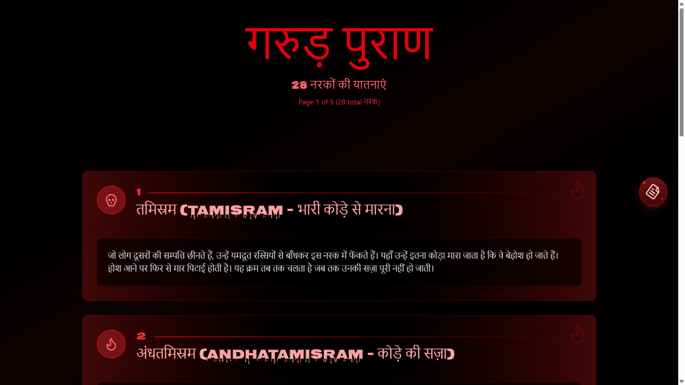
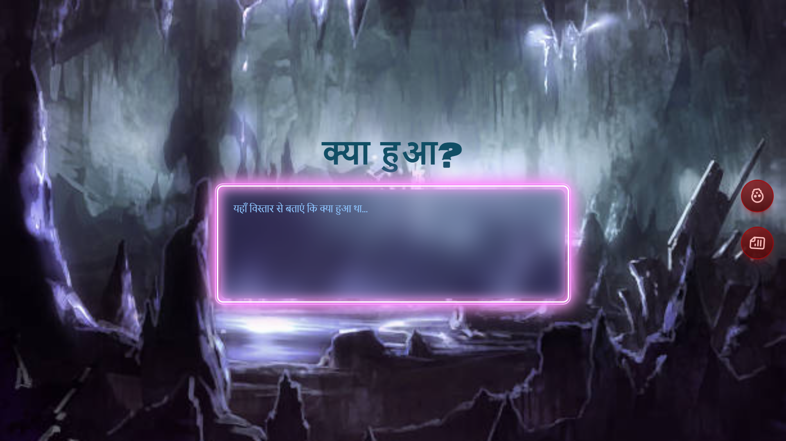

# ⚖️ Aparichit - Justice System App

<div align="center">


**"जहाँ न्याय है, वहीं धर्म है"**  
_(Where there is justice, there is righteousness)_

</div>

---

## 🎬 Concept Overview

**Aparichit** is inspired by the iconic movie of the same name, where justice is served to those who escape the conventional legal system. This app provides a platform for people who are troubled by wrongdoers and feel helpless in seeking justice.

<div align="center">
</div>

---

## 📖 Story Behind the App

The app is based on the journey of **Ambi**, a person who faces harassment and injustice from corrupt individuals but finds himself powerless to act. One day, he discovers a mysterious card containing a website link. Upon opening the link, he encounters **Aparichit** - a digital vigilante who promises justice according to the principles of **Garud Puran** (ancient Hindu scripture describing consequences for sins).

<div align="center">

</div>

---

## ⚖️ Core Concept

### 🎯 The Philosophy

Aparichit targets individuals who:

- 🚫 **Don't understand humanity** and show no empathy towards others
- 💔 **Ignore the pain and suffering** of fellow human beings
- 🏛️ **Deceive the government** and indulge in corruption
- ⚠️ **Engage in immoral behavior** and wrongdoing
- 📋 **Don't perform their duties properly** (including government workers and officials)
- 💰 **Exploit their positions** for personal gain

### ✨ The Promise

Aparichit ensures that every wrongdoer receives punishment according to the **Garud Puran**, an ancient text that describes the consequences of one's actions (karma).

<div align="center">

</div>

---

## 🔧 How the App Works

### 📍 Step 1: Initial Introduction

When a user accesses the website, Aparichit introduces itself with a powerful message:

> _"Those who don't understand humanity, those who don't understand the pain of others, those who deceive the government, those who engage in immoral conduct, those who don't do their work properly - whether government workers or anyone else - all such people will be punished by Aparichit according to the Garud Puran."_

<div align="center">

</div>

### 📝 Step 2: Complaint Submission

The user is then prompted to provide details about the wrongdoer:

#### Required Information:

1. **What crime/wrongdoing was committed?**
   - Describe the offense in detail
2. **Identity of the wrongdoer:**
   - Name (if known)
   - Approximate age
   - Gender (Male/Female/Other)
   - Any other identifying information
3. **If exact details are unknown:**
   - Provide approximate information
   - Share whatever details are available

<div align="center">

</div>

### ✅ Step 3: Confirmation & Assurance

Once the user submits the complaint, a video message plays featuring Aparichit, which states:

> _"Don't worry. Everyone will receive justice. Punishment will be delivered according to the Garud Puran."_

<div align="center">

</div>

---

## 🎯 Key Features

<table>
<tr>
<td width="50%">

### 🔒 Anonymous Reporting

Users can report wrongdoers anonymously without revealing their identity

</td>
<td width="50%">

### 📋 Detailed Complaint System

Structured form to capture all relevant information about the wrongdoing

</td>
</tr>
<tr>
<td width="50%">

### 🎥 Video-Based Communication

Aparichit communicates through powerful pre-recorded video messages

</td>
<td width="50%">

### ✅ Justice Assurance

Every submission receives confirmation of action being taken

</td>
</tr>
<tr>
<td width="50%">

### 📜 Based on Ancient Principles

Punishments aligned with Garud Puran teachings

</td>
<td width="50%">

### 🌐 User-Friendly Interface

Simple and intuitive design for easy navigation

</td>
</tr>
</table>

---

---

## ⚠️ Important Disclaimer

<div align="center">

### ⚡ THIS IS A FICTIONAL PLATFORM ⚡

</div>

This app is a **conceptual/fictional platform** inspired by the movie "Aparichit." It is designed for:

- 🎭 **Creative storytelling**
- 📢 **Social awareness**
- 🎬 **Entertainment purposes**

> **⚠️ WARNING:** This is **NOT a real vigilante service.** All legal matters should be handled through proper legal channels and law enforcement authorities.

---

## 🎭 Target Audience

- 🎬 Fans of the "Aparichit" movie
- ⚖️ People interested in justice-themed applications
- 📖 Users who enjoy interactive storytelling experiences
- 🌍 Social awareness enthusiasts

---

## 💡 Vision

To create an immersive experience that reminds people of their moral responsibilities and the importance of:

- ✅ **Integrity** in public service
- ❤️ **Empathy** towards fellow humans
- 🤝 **Ethical conduct** in daily life
- 📊 **Accountability** for one's actions

---

## 🚀 Future Enhancements

- [ ] 🌐 Multi-language support (Hindi, English, Tamil, Telugu, etc.)
- [ ] 💬 Community forum for discussions
- [ ] 📚 Educational content about ethics and morality
- [ ] 🔗 Integration with real legal aid resources
- [ ] 📖 Success story sharing (fictional narratives)
- [ ] 📱 Mobile app development (iOS & Android)
- [ ] 🎨 Enhanced UI/UX with animations
- [ ] 🔔 Notification system for updates

---

## 🛠️ Technology Stack

```
Frontend: HTML5, CSS3, JavaScript, React
Backend: Node.js, Express
Database: MongoDB
Video Hosting: AWS S3 / YouTube API
Hosting: Vercel / Netlify
```

---

## 📝 Usage Guidelines

1. **Access** the website through the provided link
2. **Watch** the introductory video by Aparichit
3. **Fill out** the complaint form with accurate details
4. **Submit** the form
5. **Receive** confirmation message

---

## 🤝 Contributing

This is a conceptual project. Contributions for improving the storytelling experience, user interface, and educational content are welcome!

### How to Contribute:

1. Fork the repository
2. Create your feature branch (`git checkout -b feature/AmazingFeature`)
3. Commit your changes (`git commit -m 'Add some AmazingFeature'`)
4. Push to the branch (`git push origin feature/AmazingFeature`)
5. Open a Pull Request

---

## 📧 Contact

For queries and suggestions, please reach out through:

- 📧 Email: contact@aparichit.com
- 🌐 Website: https://aparichit-xi.vercel.app

## 🙏 Acknowledgments

- Inspired by the movie **"Aparichit"** (Anniyan)
- Based on the principles of **Garud Puran**
- Special thanks to all contributors and supporters

---

<div align="center">

### ⚖️ Remember ⚖️

**For real-world justice, always approach proper legal authorities and law enforcement agencies.**

**"न्याय ही धर्म है, धर्म ही जीवन है"**  
_(Justice is righteousness, righteousness is life)_

---

Made with ❤️ for social awareness

</div>
